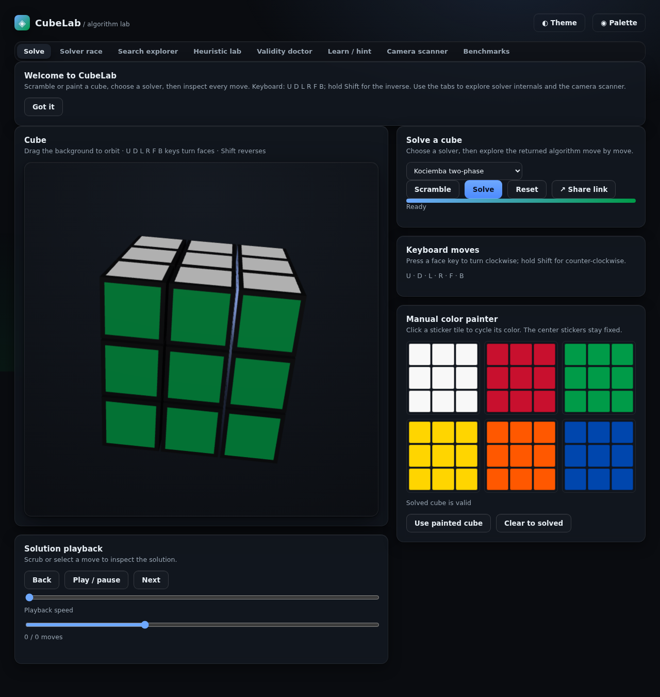
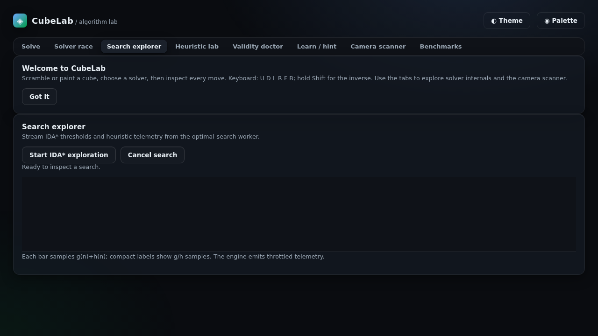
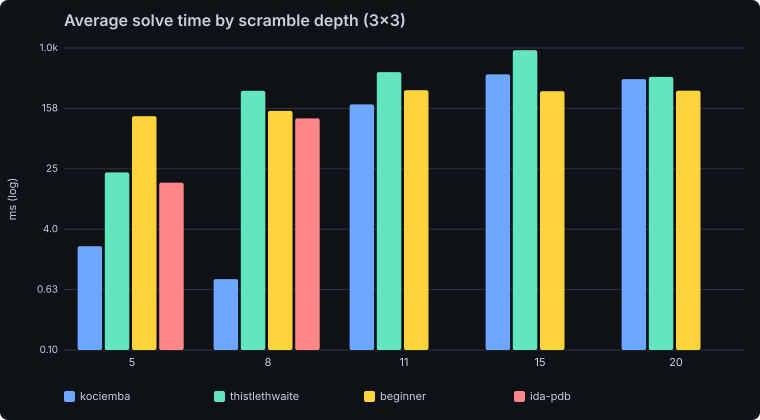
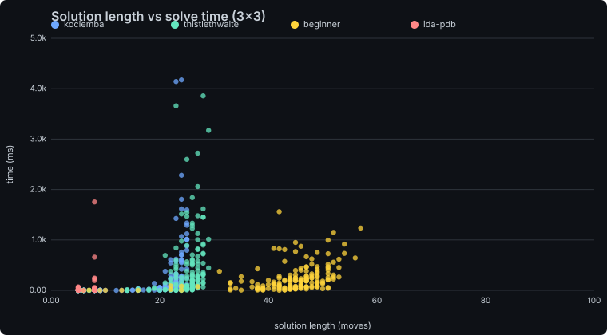
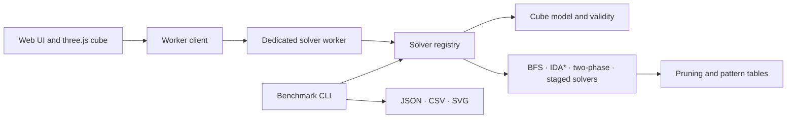

# CubeLab

[](https://github.com/barbierajput378-pixel/rubiks-solver-lab/actions/workflows/ci.yml)


**▶ Live demo: https://rubiks-solver-lab-web.vercel.app**

CubeLab is an interactive Rubik’s Cube solver and algorithm lab. It puts several search strategies behind one TypeScript solver interface, then lets you inspect their solutions, search telemetry, and limits in the browser. The engine and app run locally; there is no solve API or server requirement.

**What it shows off:** six solvers behind one interface (layer-by-layer, **Kociemba two-phase**, **Thistlethwaite**, **optimal IDA\*** with pattern-database heuristics, and 2×2 bidirectional BFS), a Web-Worker solve pipeline, a three.js cube, live search telemetry, and a reproducible benchmark harness that generates the plots below.

### Benchmarks at a glance

Over 30 fully-scrambled (20-move) cubes, seed 42 — numbers from the committed run:

| Solver | Avg solution length | Avg time | Avg nodes expanded |
|---|---|---|---|
| **Kociemba** (two-phase) | **~23 moves** | ~0.39 s | ~46k |
| Beginner (layer-by-layer) | ~46 moves | ~0.27 s | — |

Kociemba finds solutions roughly **half as long** as the human-style method by searching a structured move space with pattern-database pruning. Full per-depth tables and plots are in [`docs/BENCHMARK_ANALYSIS.md`](docs/BENCHMARK_ANALYSIS.md).

## Screenshots





Benchmark plots below are generated from the committed run, not illustrative data.

## Get started

Requires Node.js 20 or newer and npm. From the repository root:

```sh
npm install
npm run build:engine
npm run dev
```

Vite prints a local URL. Use **Scramble**, choose a solver, then select **Solve**. Drag the cube background to orbit; drag a sticker to turn that face. Keyboard moves are `U D L R F B`; hold `Shift` for the inverse. Use the playback controls or arrow keys to step through a solution.

Other commands:

```sh
npm test                 # engine and scanner-classifier tests
npm run lint             # TypeScript checks
npm run build:web        # production app in web/dist
npm run bench -- --help  # benchmark CLI options
```

The benchmark CLI is also available directly after the engine build:

```sh
cd engine
node dist/bench/cli.js --solvers all --scrambles 30 --depths 5,8,11,15,20,random \
  --seed 42 --timeout 10000 --maxOptimalDepth 8 --out ../bench-out \
  --plots ../docs/benchmarks
```

## What’s inside

- **Solve:** interactive three.js cube, random-move scrambles, six solver choices, worker-based solving, move playback, speed control, shareable hash links, and a manual sticker painter with reachability feedback.
- **Solver Race:** run 2–4 compatible solvers in isolated workers and compare live node, depth, and time telemetry.
- **Search Explorer:** inspect IDA* thresholds, `g(n)` and `h(n)` samples, and a sampled depth view.
- **Heuristic Lab:** toggle the corner pattern database and edge-orientation table and compare search cost on the same state.
- **Validity Doctor:** get a plain-language explanation for common invalid sticker states and a suggested class of correction.
- **Explain / Learn:** inspect labeled solver stages and reveal solution moves one at a time.
- **Camera scanner:** calibrate sticker colors from face centers, view confidence per sticker, upload an image, and correct stickers manually. Browser camera permission is optional.
- **Benchmark dashboard:** view the bundled JSON results or load another benchmark JSON file.
- Dark and light themes, a colorblind-safe cube palette, reduced-motion behavior, responsive layout, keyboard support, and ARIA labels — now with consistent per-view page headers and designed empty, loading, and error states throughout.

## Design

CubeLab's interface is built as a precision instrument rather than a generic dashboard — an "Optical Bench" direction documented in [DESIGN.md](DESIGN.md) (the candidates it was chosen from, and why, are in [docs/redesign/DIRECTIONS.md](docs/redesign/DIRECTIONS.md); the pre-redesign audit is in [docs/redesign/AUDIT.md](docs/redesign/AUDIT.md)).

- **One accent, cube-first color.** Cool graphite neutrals and a single phosphor-cyan accent (`#46d6c4` dark, `#0e9e8c` light) used only for focus, active state, live traces, and meters — so the six saturated cube sticker colors stay the most vivid marks on screen in every theme, including the colorblind-safe palette.
- **An instrument motif.** A faint engineering-grid substrate sits behind the app, hairline rails with corner ticks frame each view's page header, and the 3D cube is lit like a specimen on a stage: three-point lighting with ACES tone mapping, a soft contact shadow, rounded cubies, and a gentle idle drift that stops under reduced motion.
- **Deliberate type.** Space Grotesk for UI and headings, JetBrains Mono for move notation, telemetry, and every table figure, with tabular numbers throughout. Both fonts are self-hosted woff2 subsets, so there are no external font requests.
- **Finished states everywhere.** Every view has a designed empty state plus loading/indeterminate and inline error states. The Search Explorer and Benchmarks charts use clean axes, soft gridlines, tooltips, and a stable per-solver color map; the Solver Race gives each solver a colored identity, an animated bar, rank badges, and a clear winner moment.
- **Preserved behavior.** Dark/light themes, the colorblind cube palette, `prefers-reduced-motion`, ARIA roles/labels and visible focus rings, the keyboard shortcuts (`U D L R F B`, `Shift`, arrow keys, and `?` for the shortcut panel), the share-link hash format, Web Worker solving, and the IndexedDB table cache are all unchanged.

Full tokens (color, type, 4px spacing, radius, elevation, motion, and z-index scales) and per-component rules live in [DESIGN.md](DESIGN.md).

## Benchmark snapshot

Seed 42, 30 scrambles per requested depth, 10-second solve limit. These are measurements from one run; millisecond values are machine-dependent. Solution lengths are mean face turns.

| Solver | Depth | Solved | Mean moves | Mean time | Mean nodes |
|---|---:|---:|---:|---:|---:|
| Kociemba-style two-phase | 5 | 30/30 | 6.43 | 2.37 ms | 204 |
| Kociemba-style two-phase | 11 | 30/30 | 20.53 | 179.17 ms | 20,596 |
| Kociemba-style two-phase | 20 | 30/30 | 23.07 | 387.50 ms | 46,260 |
| Kociemba-style two-phase | random | 29/30 | 23.10 | 466.00 ms | 39,486 |
| Thistlethwaite | 15 | 28/30 | 25.29 | 936.29 ms | 61,932 |
| Beginner hybrid | random | 30/30 | 47.03 | 292.83 ms | 0 reported* |
| IDA* + PDB | 8 | 30/30 | 7.93 | 116.97 ms | 1,865 |

*The beginner solver does not currently populate a node counter, so `0` means “not reported,” not zero search work. IDA* rows exist only through the configured depth cap of 8. The 2×2 BFS solvers are measured on their supported 2×2 projections and are not comparable to full 3×3 results. The beginner solver guides the cross and first layer with IDA*, then uses the two-phase engine to finish the middle and last layers. Read the full [benchmark analysis](docs/BENCHMARK_ANALYSIS.md) before comparing algorithms.





## Architecture



The engine’s public boundary is `Solver`; the web app imports it through `@cubelab/engine`. Expensive solve work runs in dedicated workers. The large optimal-search pattern tables are cached in IndexedDB on browsers that support it. The benchmark CLI reuses the same solver registry and writes raw rows plus aggregate plots.

## Algorithms and honest limits

- **BFS and bidirectional BFS:** optimal search for the supported 2×2 corner state space; state-space growth makes these unsuitable for 3×3.
- **IDA* with pattern databases:** optimal when it completes, using a corner permutation/orientation database and edge-orientation database combined with an admissible max heuristic. The benchmark caps it at shallow depths; this is not a practical random 3×3 solver.
- **Kociemba-style two-phase:** reduces orientation and slice placement, then solves within the subgroup. This is an independently implemented educational solver, not a claim of competition-grade speed or exact Kociemba parity.
- **Thistlethwaite:** staged subgroup reduction. The implementation merges the classic final two stages into one domino solve.
- **Beginner hybrid:** IDA*-guided cross and first layer, then the two-phase engine completes the middle and last layers. It is not a fully table-driven beginner method.

This repository is TypeScript-first. The original environment had no Emscripten toolchain; a future C++17/WASM engine can implement the same solver boundary. The model uses geometric move derivation and the conventions in [docs/CONVENTIONS.md](docs/CONVENTIONS.md). See [docs/RESEARCH.md](docs/RESEARCH.md) for research notes.

### Current product limits

- Solution stages highlight the active stage card and its explanation. The cube does not yet highlight individual cubies because the current solver stage data does not identify affected piece sets.
- The camera scanner asks the user to frame and capture each face; it does not automatically locate or orient a cube in an arbitrary scene. Center-color calibration and manual/photo fallbacks are available.
- The optional speedcubing timer and solve-then-compare mode are not included.
- Lighthouse performance was 65/100 in the recorded local desktop run; see the measured note above.

## Why I built this

I wanted a project where data structures and search algorithms could be seen working instead of hidden behind a solve button. Cube solving gives a compact way to compare breadth-first search, IDA*, pattern databases, subgroup reduction, heuristics, and trade-offs between optimality and speed. The interface makes those internals visible while keeping the cube model and measured claims inspectable.

## Development and deployment

The GitHub Actions workflow type-checks, tests, and builds the engine and web app. Pushes to `main` deploy `web/dist` to GitHub Pages when Pages is enabled for the repository. The Vite base is relative so project pages can load assets below the repository path.

Local production-preview Lighthouse run (2026-10-08, desktop preset, headless Chromium): **65 performance**, **100 accessibility**. Lighthouse reported 12.96 s total blocking time in this constrained WSL environment, so the performance score is a clear follow-up area; the 3D viewer is split into a deferred chunk, and the main entry bundle is about 40 kB before gzip.

## License

MIT. See [LICENSE](LICENSE). The UI uses three.js (MIT); the solver logic is implemented in this repository.
